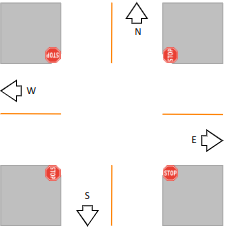
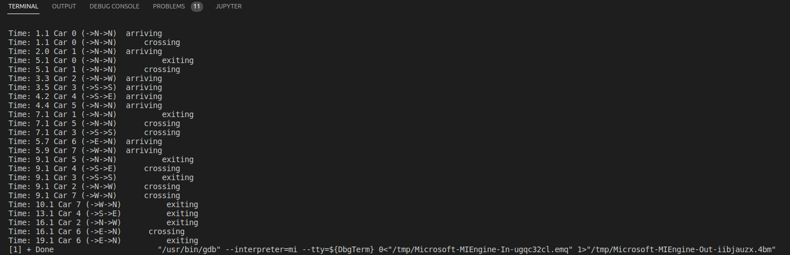
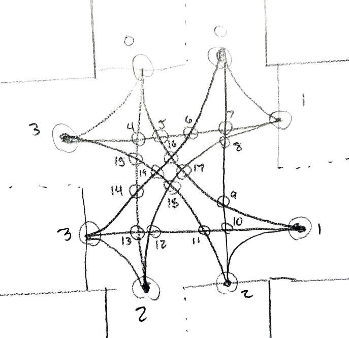

# traffic-control

# Programming 3 (P3): Traffic Control

Instructor: Dr. Shengquan Wang

Student: Nate Pierce, University of Michigan Dearborn

CIS 450 Operating Systems

# Overview

This project implements a four way stop traffic control program by making use of POSIX pthreads and semaphores. Concurrency is used to synchronize traffic to avoid collisions and respect right of way.



The following rules are obeyed:

- Multiple cars may enter the intersection at once so long as there are no collision points along the cars trajectory. 
- A car may not proceed at all if any points along its trajectory result in a collision (until the collision points are posted by the other vehicle exiting).
- A car may proceed if it arrives after another stopped car so long as it does not result in a collision.
- A car only gives up right of way along its trajectory once it has cleared the intersection. This results in vehicle travelling the same direction from the same origin waiting for the first vehicle to pass.
- A vehicle may turn left, right, or go straight. 

Note that two vehicles making left turns from opposite directions do not result in a collision. Each crossing type takes a constant amount of time. For left turns, 3 seconds. Straight, 2 seconds. Right, one second. There are also 8 cars in the simulation.

This program simulates cars as threads, and collision points (semaphores) along the intersection as resources which threads compete for.


# Building

Compile with gcc -o tc tc.c -lpthread -lrt.

# Testing

The output does not perfectly match the output as provided in the handout because the intersection logic is slightly different. For example, the handout suggests that a car heading the same direction towards a step sign as the car that most recently crossed does not need to wait for the stop sign. In this program, a vehicle will come to a stop at the sign no matter what. Also, there is no "order of arrival" preserved -- if a car has stopped at the stop sign and all collision points along its trajectory are unlocked, it will proceed through the intersection, even if there is already a car in the intersection. For example, two cars making a left from oncoming directions will not collide, and two vehicles going straight through from opposite directions also will not collide.  Output from the program is printed below.



Testing was done by carefully adding debugging print statements at many points of program execution. I added a DEBUG flag to the global variables for enabling/disabling printing of these. 


# Implementation

First, a index scheme was devised to define collision points along the trajectories of turns. There are two sets of indices -- one for stop signs, and one for the intersection. In total, there are 24 semaphores (4 for stopsigns and 20 for the intersection. See photograph below.). 

```
sem_t stop_signs[4];
sem_t intersection[20];
```


The semaphores are then initialized carefully so that every crossing through the intersection is defined (i.e., north to south, west to east, etc.).

```
sem_t *west_to_south[5] = {&intersection[8], &intersection[17], &intersection[18], &intersection[12], &intersection[2]};
sem_t *west_to_west[5] = {&intersection[7], &intersection[6], &intersection[5], &intersection[4], &intersection[3]};
```

Some global variables are used to define the constant turn times, the number of cars, and the exit time for the vehicle which most recently exited the intersection (this will be useful when updating wait times for vehicles waiting to cross). There is also a debug flag that was used throughout the testing/implementation of this program.

From a high level, there are three functions that do most of the work in the simulation: ArriveIntersection, CrossIntersection, and ExitIntersection. The idea behind each one of these is laid out in the handout -- more specific implementation details are below.

There are two structs which define the directions (origin, target), and the state for each vehicle, which constitutes the directions for each car, the car ID, arrival times, cross times, etc. 

Main calls two functions for semaphore initialization and the simulation function. The simulate function initializes all of the car states. Then, for each car, a thread is created, which calls ArriveIntersection for each thread. pthread_join() is called for each thread to prevent premature exit of the parent thread.

As indicated in the handout, most of the work for the intersection logic is done in ArriveIntersection. As a reminder, cars are represented as threads, each running simultaenously representing different vehicle states (arrival times, headings, IDs, etc.) and collision points along the trajectory for each turn are the units of resources/semaphores that the cars compete for. 

Each thread will have some contextual information intialized in ArriveIntersection, including: an array of five integers constituting collision points along the turn (both straight and left will all have 5 collision points -- for right turns, which have one collision point, the first index in the array represents the index of the collision point and the rest of the values are set to -1. This is useful in subsequent functions that perform logic based on the collision points). There is also a character representing the turn ({'L', 'R', 'S'}). There is also an integer variable for the number of collision points associated with a specific turn. 

There are a number of help functions I use here, such as get_turn() which will give us the character representing the turn for a specific car. 

The first semaphore operations is done in check_and_lock_stop_sign(), which takes a car state and will wait indefinitely if other cars are stopped at the intersection (stop sign semaphores are released the instant the car enters the intersection). When ready, the car will lock the semaphore associated with its stop sign depending on its original direction. 

```
// lock the appropriate stop sign
if (origin == 'N') {
    sem_trywait(&stop_signs[2]);
}
else if (origin == 'E') {
    sem_trywait(&stop_signs[3]);
}
else if (origin == 'S') {
    sem_trywait(&stop_signs[0]);
}
else {
    sem_trywait(&stop_signs[1]);
}
```    

The semaphore checking and locking is done in check_intersection(). In this function, we get the origin direction and target direction of the car at the intersection. We assume at this point we have obtained a traffic sign lock and are ready to enter. 

Depending on the turn (north to west for example), we assign the collision point indices as drawn in the diagram above. The collision points are used to iterate through each uniquely defined semaphore array. Before we call sem_wait() on the first collision point, we check for any locked collision point along our trajectory. The idea here is to prevent the vehicle from entering the intersection when its clear but stopping for a locked collision point somewhere in the middle of the turn. This could result in a deadlock, where no car would proceed. All of this is done in lock_intersection(). 

```
for (int i = 0; i < array_size; i++) {
    idx = collision_points[i];

    // look for collision points along the trajectory and wait if there are any currently locked
    for (int j = i; j < array_size; j++) {
        sub_idx = collision_points[j];
        sem_getvalue(&intersection[sub_idx], &value);
        // wait at point in trajectory where we detect a collision
        while (abs(value) <= 0) {
            sem_getvalue(&intersection[sub_idx], &value);
        }
    }
    sem_trywait(&intersection[idx]);
    }
}
```

Noticed sem_getvalue is used here -- it's used throughout this program to determine if there is a lock on a specific semaphore.

Execution returns to the ArriveIntersection scope, where CrossIntersection() is called. At this point we are ready to cross -- there are no detected collisions on our trajectory, and all of the points along our trajectory are locked by our current car. This function calls a helper function to update and print the time of the car's crossing. 

We use Spin() from the provided common.h file to simulate the car crossing the intersection for x amount of time, as defined in the handout. Once we cross the intersection, we release our locks on the stop sign. 

We return back to ArriveIntersection, where ExitIntersection is immediately called. Again, we update the time of the vehicle's crossing, then call a function that unlocks collision points for the car that just crossed using sem_post(&intersection[i]).

The functions that call sem_post() on the stop signs and the intersection collision points look similar to the ones which check and lock them. A little less logic is needed as we only want to post the semaphore once we are done with it. 